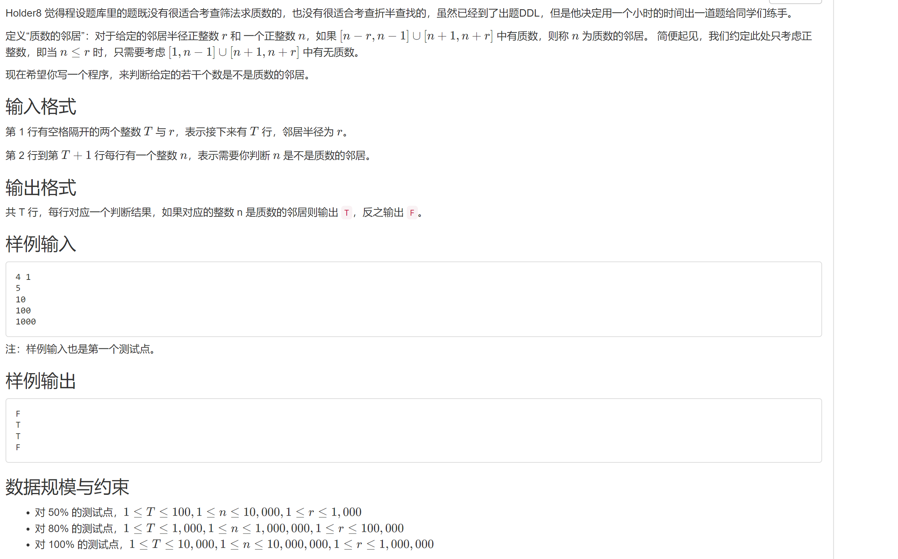

## 2022/10/18	最大子矩阵（动态规划）
* Question
  
* 舍友提示是一个3维动态规划问题(见1_1)，用穷举会超时(见1_0)
* wy用简单容斥原理做出


## 2022/10/24	素数邻居
* Question
  
* Hint
  * [用筛选法求质数，并将质数存放在一起]
  * [用折半查找到最近的质数并进行判断]
* 没看懂提示第二条是什么意思


## 最大子矩阵

### 问题描述

对一个m×n的整数矩阵，在上面找一个x×y的子矩阵，使子矩阵中所有元素的和最大。

### 输入形式

每一组测试数据的第一行为4个正整数m，n，x，y（0<m，n<1000，0<x≤m，0<y≤n），表示给定的矩形有m行n列。

接下来这个矩阵，有m行，每行有n个不大于1000的正整数。

### 输出形式

对于每组数据，输出一个整数，表示子矩阵的最大和。

### 样例输入

```bash
4 5 2 2
3 361 649 676 588
992 762 156 993 169
662 34 638 89 543
525 165 254 809 280
```

### 样例输出

```bash
2474
```

### 样例说明

测试数据的文件名为in.txt


## 合并链表

### 问题描述

两个非降序链表的并集，例如将链表1->2->3 和 2->3->5 并为 1->2->3->5，只能输出结果，不能修改两个链表的数据。

### 输入形式

第一行为第一个链表的各结点值，以空格分隔。

第二行为第二个链表的各结点值，以空格分隔。

### 输出形式

合并好的链表，以非降序排列，值与值之间以空格分隔。

### 样例输入

```bash
4 7 10 34
1 4 6 29 34 34 52
```

### 样例输出

```bash
1 4 6 7 10 29 34 52
```

### 其它

评分标准：要使用链表实现，否则不能得分。

考察：建单链表，头插法、尾插法、链表去重复项、链表排序、输出链表、两有序链表合并

建议：将代码写得更健壮一些，能实现**两无序链表有序合并**

```bash
创建有序单链表A: 1 4 6 7 9
去重复项后:1,4,6,7,9

创建有序单链表B: 2 4 4 6 9 1
去重复项后:2,4,6,9,10

合并后结果:1,2,4,6,7,9,10
```

```bash
创建无序单链表A: 1 4 6 3 4 9
排序后结果:1,3,4,4,6,9
去重复项后:1,3,4,6,9

创建无序单链表B: 5 7 3 4 8 9
排序后结果:3,4,5,7,8,9
去重复项后:3,4,5,7,8,9

合并后结果:1,3,4,5,6,7,8,9
```


## 表达式树实现计算器 

### 问题描述

从标准输入中读入一个整数算术运算表达式，如24 / ( 1 + 2 + 36 / 6 / 2 - 2) * ( 12 / 2 / 2 )= ，计算表达式结果，并输出。

要求：

1. 表达式运算符只有+、-、*、/，表达式末尾的=字符表示表达式输入结束，表达式中可能会出现空格；

2. 表达式中会出现圆括号，括号可能嵌套，不会出现错误的表达式；

3. 出现除号/时，以整数相除进行运算，结果仍为整数，例如：5/3结果应为1。

4. 要求采用表达式树来实现表达式计算。

表达式树（expression tree）：

我们已经知道了在计算机中用后缀表达式和栈来计算中缀表达式的值。在计算机中还有一种方式是利用表达式树来计算表达式的值。表达式树是这样一种树，其根节点为操作符，非根节点为操作数，对其进行中序遍历将计算表达式的值。由后缀表达式生成表达式树的方法如下：

读入一个符号：

如果是操作数，则建立一个单节点树并将指向他的指针推入栈中；

如果是运算符，就从栈中弹出指向两棵树T1和T2的指针（T1先弹出）并形成一棵新树，树根为该运算符，它的左、右子树分别指向T2和T1，然后将新树的指针压入栈中。

例如输入的后缀表达为：

```bash
ab+cde+**
     *
   /   \
  +	     *
 /  \   /  \
a    b c    +
		  /  \	
	     d     e
```

### 输入形式

从键盘输入一个以=结尾的整数算术运算表达式。操作符和操作数之间可以有空格分隔。

### 输出形式

首先在屏幕上输出表达式树根、左子节点及右子节点上的运算符或操作数，中间由一个空格分隔，最后有一个回车（如果无某节点，则该项不输出），然后输出表达式计算结果。

### 样例输入

```bash
24 / ( 1 + 2 + 36 / 6 / 2 - 2) * ( 12 / 2 / 2 )   =
```

### 样例输出

```bash
*  /  /      18
```

### 样例说明

按照运算符及括号优先级依次计算表达式的值。在生成的表达树中，*是根节点的运算符，/ 是根节点的左子节点上运算符，/是根节点的右子节点上运算符，按题目要求要输出。

### 其它

考察：二叉树、堆栈，递归


## 最少布线（最小生成树）

### 问题描述

武大文理学部主要办公科研楼有行政楼、逸夫楼、物理楼、生科楼、化学楼、图书馆等，武大信息中心计划要给相关建筑物间铺设光缆进行网络连通，请给出用料最少的铺设方案。

编写程序输入一个办公区域分布图及建筑物之间的距离，计算出用料最少的铺设方案（只有一组最优解，不用考虑多组解)。要求采用Prim或Kruskal算法实现。

### 输入形式

办公区域分布图的顶点（即建筑物）按照自然数（0，1，2，n-1）进行编号，从标准输入中首先输入两个正整数，分别表示线路图的顶点的数目和边的数目，然后在接下的行中输入每条边的信息，每条边占一行，具体形式如下：

<n> <e>

<id> <vi> <vj> <weight>

...

即顶点vi和vj之间边的权重是weight，边的编号是id

### 输出形式

输出铺设光缆的最小用料数，然后另起一行输出需要铺设的边的id，并且输出的id值按照升序输出。

### 样例输入

```bash
6 10
1 0 1 600
2 0 2 100
3 0 3 500
4 1 2 500
5 2 3 500
6 1 4 300
7 2 4 600
```

### 样例输出

```bash
1500
2 4 6 8 9
```

### 其它

考察图的定义、构建、排序、最小生成树算法（prim算法：lowcost数组、closest数组的变化）、（kruskal算法） 


## 小型图书管理系统

### 问题描述

小明同学特别喜欢买书看书。由于书较多，摆放杂乱，找起来非常麻烦。这学期小明同学上了数据结构与程序设计课后，决定改变这种状况：用C++开发一个小型图书管理系统。

系统中包含的**图书信息有：书名、作者、出版社、出版日期**等。

首先，图书管理系统对已有的书（**原始书库，无序**，存放在一个文本文件中）按书名字典序进行（**排序**）摆放（即将原始无序的图书信息文件生成一个有序的文件，即**新书库，有序**），以便查找。

该管理系统可以对**新书库中图书条目进行如下操作**：（**有序表的插入、查找、删除**）

1. **录入**。新增书录入到书库中（即从输入中读入一条图书信息插入到已排序好的图书文件相关位置处）

2. **查找**。按书名或书名中关键字信息在书库中查找相关图书信息，若有多本书，按字典序输出。

3. **删除**。输入书名或书名中关键字信息，从书库中查找到相关书并将其删除，并更新书库。

### 输入形式

原始的图书信息（原始书库）保存在当前目录下的**books.txt**中。

用户操作从控制台读入，首先输入操作功能序号（1**代表录入操作，2代表查找操作，3代表删除操作，0代表将已更新的图书信息保存到书库中并退出程序**），然后在下一行输入相应的操作信息（**录入操作后要输入一条图书信息，查找和删除操作后只要输入书名或书名中部分信息**）。程序支行过程中可以进行多次操作，直到退出（输入操作0）程序。

要求：

1. 原始文件中的图书信息与录入的图书信息格式相同，每条图书信息都在一行上，包括书名（不超过50个字符）、作者（不超过20个字符）、出版社（不超过30个字符）和出版日期（不超过10个字符），只由英文字母和下划线组成，用一个空格分隔。图书信息总条数不会超过500.

2. 下划线字符参加排序。

3. 图书不会重名。

### 输出形式

进行录入和删除操作，系统会更新图书信息，但不会在控制台窗口显示任何信息。

进行查找操作后，将在控制台按书名字典序分行输出查找到的图书信息，书名占50个字符宽度，作者占20个字符宽度，出版社占30个字符宽度，出版日期占10个字符宽度，都靠左对齐输出。

最终按字典排序的图书信息保存在当前目录下的**ordered.txt**中，每条图书信息占一行，格式与查找输出的图书信息相同。

### 样例输入

```bash
1   
Data_structures_and_C_programs Christopher Addison_Wesley 1988
2   
structure
1  
 The_C_programming_tutor Leon_A_Wortman R_J_Brady 1984
2   
rogram
3  
rogramming
0
```

### 其它

考察字符串的操作：strcmp、findstr、顺序表排序（字典排序）、顺序表的查找，也可以使用STL得string容器，数据多时可以考虑建索引。